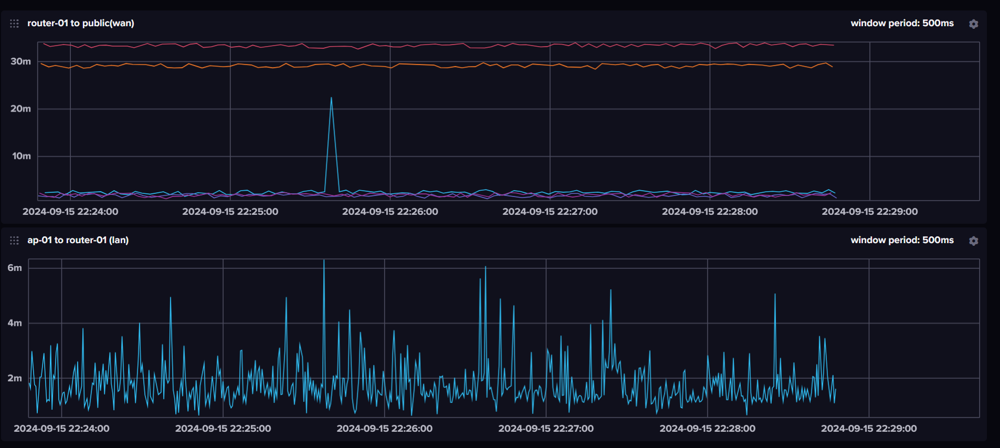

# ping-watcher



## Usage

```
Usage of ping-watcher:
  -device string
        device name
  -influxdb-bucket string
        INFLUXDB_BUCKET
  -influxdb-org string
        INFLUXDB_ORG
  -influxdb-server string
        INFLUXDB_SERVER
  -influxdb-token string
        INFLUXDB_TOKEN
  -interval float
        interval (seconds) (default 0.5)
  -privileged
        use privileged mode
  -servers string
        PING_SERVERS (default "8.8.8.8,8.8.4.4,1.1.1.1,168.126.63.1,168.126.63.2")
```

# License

[Apache-2.0](./LICENSE)
